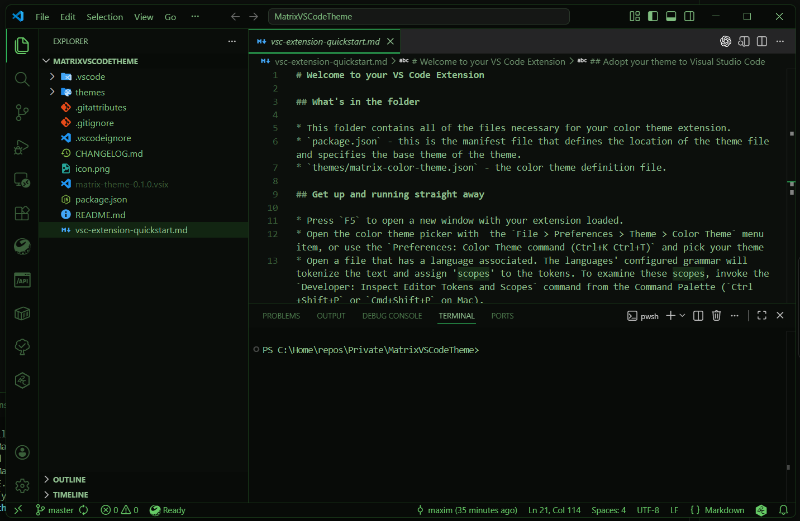
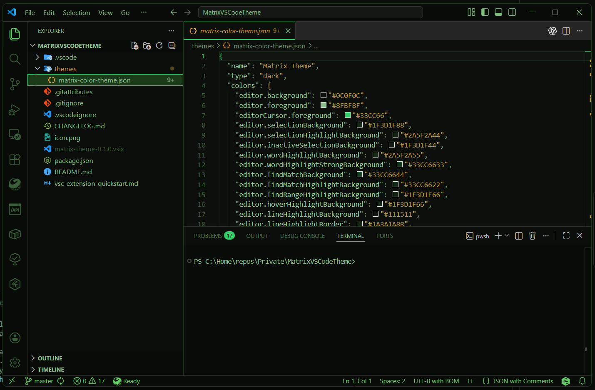

# Matrix Theme 🌐⚡

> A cyberpunk color theme for Visual Studio Code inspired by **The Matrix** — green-on-black with amber accents for an immersive coding experience.

## Screenshots


*Code editing with Matrix Theme — syntax highlighting in action*


*Integrated terminal with full ANSI color palette*

## Color Palette

| Role          | Color   | Hex       | Usage                    |
|---------------|---------|-----------|--------------------------|
| Background    | 🟩      | `#0C0F0C` | Dark green-black         |
| Foreground    | 🟢      | `#8FBF8F` | Main text                |
| Accent        | 🟢💚    | `#33CC66` | Keywords, cursor, active |
| Strings       | 🟡      | `#B89944` | Matrix amber/gold        |
| Numbers       | 🟠      | `#CC9933` | Numeric constants        |
| Functions     | 🟤      | `#CCB080` | Function names           |
| Types         | 🟢      | `#55BB66` | Classes, interfaces      |
| Variables     | 🟢      | `#99CC99` | Variables, properties    |
| Comments      | 🌿      | `#6B8F6B` | Muted green, *italic*    |
| Errors        | 🔴      | `#FF5555` | Errors, deletions        |
| Info          | 🔵      | `#33CCCC` | Info, modified           |

## Features

- 🎨 **300+ UI colors** — every VS Code surface is themed: editor, sidebar, terminal, debug, git, notifications, settings, peek view, minimap, and more
- ✨ **95+ syntax token rules** — comprehensive highlighting for JavaScript, TypeScript, Python, Rust, Java, Go, CSS, HTML, YAML, JSON, Markdown and many more
- 🧠 **55+ semantic token colors** — full semantic highlighting support for classes, interfaces, functions, modifiers, decorators, namespaces, etc.
- 🖥️ **ANSI terminal colors** — full 16-color terminal palette with Matrix aesthetics
- 🔧 **Git decorations** — added (green), modified (cyan), deleted (red), untracked, ignored, conflicted and more
- 🐛 **Debug theming** — breakpoints, debug toolbar, step icons, expression colors
- ♿ **Accessible contrast** — careful luminance ratios for readability

## Installation

### Via VS Code Marketplace (recommended)
1. Open **Extensions** (`Ctrl+Shift+X`)
2. Search for **"Matrix Theme"**
3. Click **Install**
4. Press `Ctrl+K Ctrl+T` and select **"Matrix Theme"**

### Manual
1. Clone this repository
2. Copy the folder to `~/.vscode/extensions/`
3. Reload VS Code and select the theme

## Recommended Settings

For the full Matrix experience, add these to your `settings.json`:

```json
{
  "workbench.colorTheme": "Matrix Theme",
  "editor.fontFamily": "'Cascadia Code', 'Fira Code', 'JetBrains Mono', monospace",
  "editor.fontLigatures": true,
  "terminal.integrated.fontFamily": "'Cascadia Code', 'Fira Code', monospace",
  "editor.cursorBlinking": "phase",
  "editor.cursorStyle": "line"
}
```

## Development

```bash
# Install dependencies
npm install -g @vscode/vsce

# Package the extension
vsce package

# Install locally
code --install-extension matrix-theme-0.1.0.vsix
```

## License

[MIT](LICENSE)

---

*"The Matrix is everywhere. It is all around us."* — Morpheus
